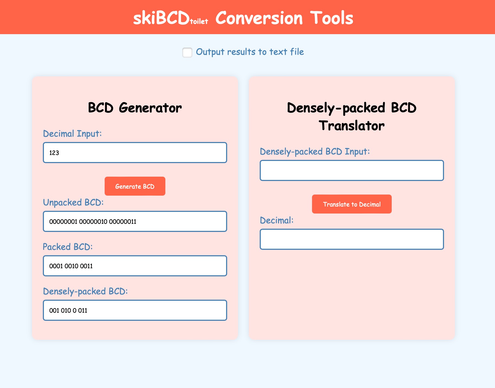
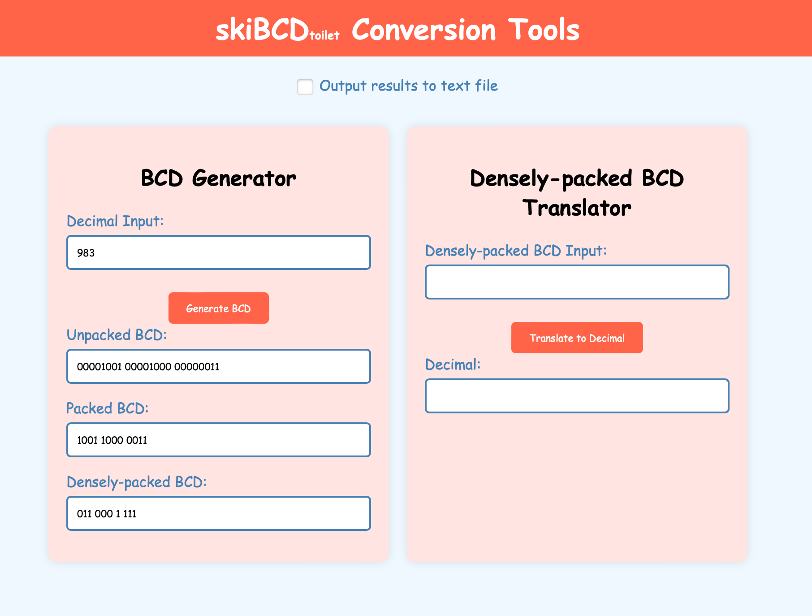
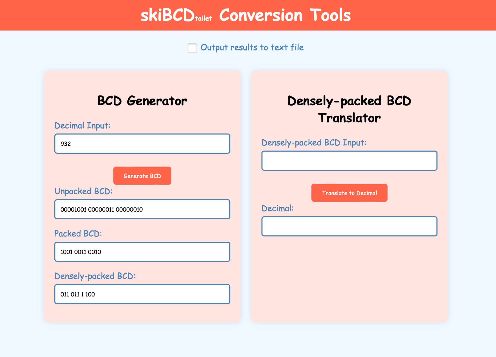
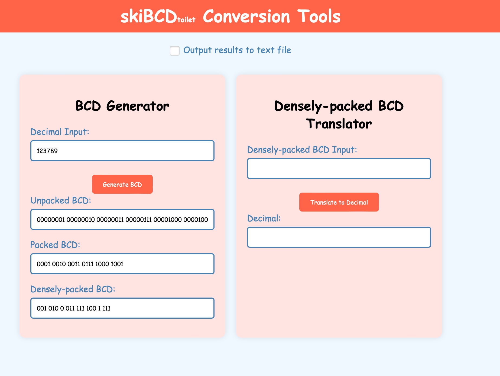
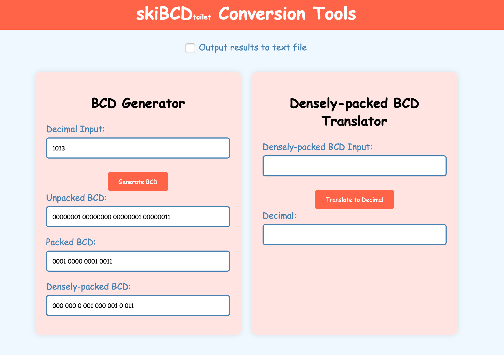
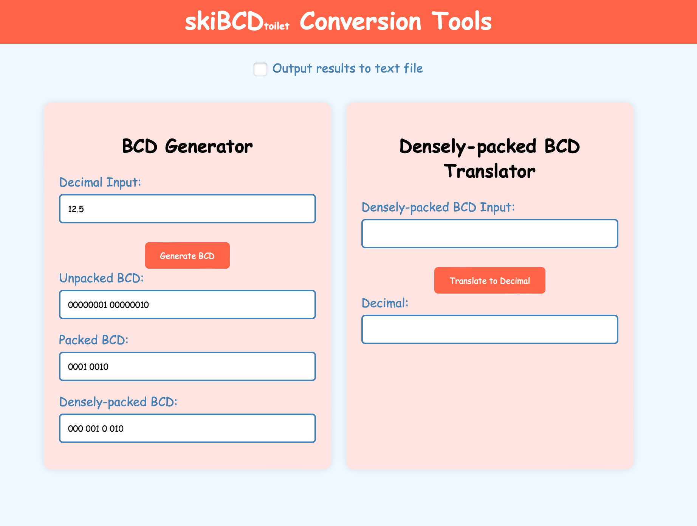
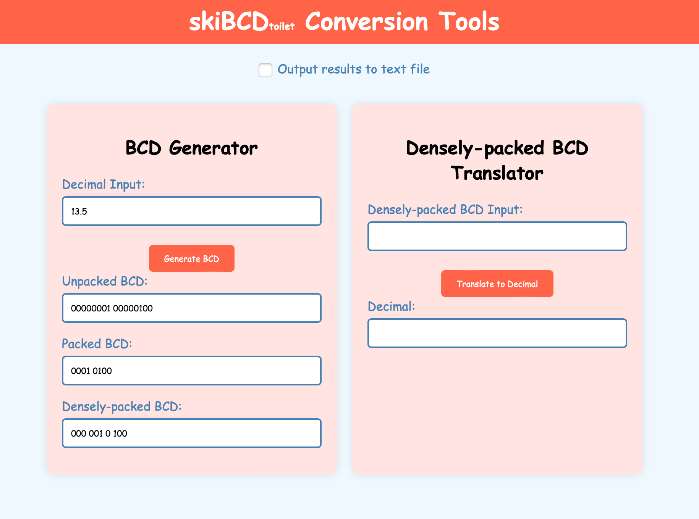
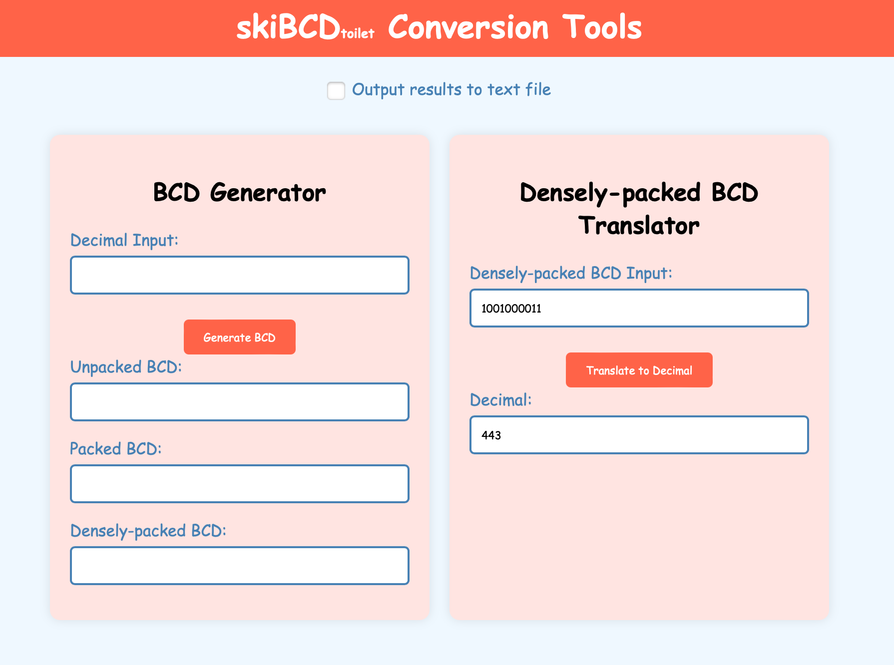
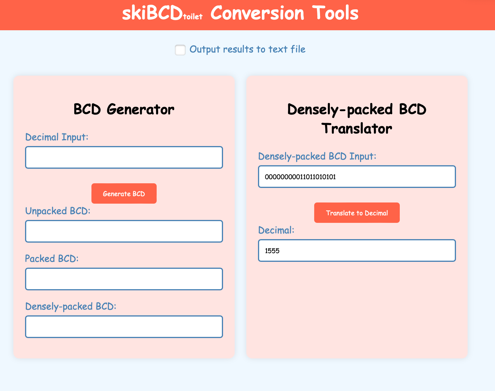

# skiBCD Toilet Conversion Tools

**skiBCD Toilet Conversion Tools** is a web-based application that provides utilities for converting between decimal numbers and various Binary-Coded Decimal (BCD) formats. This tool supports conversions to and from unpacked BCD, packed BCD, and densely-packed BCD.


## Features
- Decimal to BCD conversion:
  - Unpacked BCD
  - Packed BCD
  - Densely-packed BCD
- Densely-packed BCD to decimal conversion
- Round-to-nearest-even (NTE) function for decimal inputs
- Input validation with error messages
- Option to output results to a text file

## Live Demo
[Live Demo](https://github.com/enriquezduane/CSARCH2-SIMPROJECT/assets/63909110/aec057c5-cb57-437d-aa86-f670b04e7271)

## Installation
1. Clone the repository:
   ```
   git clone https://github.com/your-username/bcd-conversion-tools.git
   ```
2. Navigate to the project directory:
   ```
   cd CSARCH2-SIMPROJECT/
   ```
3. Open `index.html` in a web browser.

> [!TIP]
> Alternatively, you can visit [skiBCD Toilet Conversion Tools](https://enriquezduane.github.io/CSARCH2-SIMPROJECT/) to test it out without having to install anything.

## Usage
### BCD Generator
1. Enter a decimal number in the "Decimal Input" field.
2. Click the "Generate BCD" button.
3. View the results in the Unpacked BCD, Packed BCD, and Densely-packed BCD fields.

### Densely-packed BCD Translator
1. Enter a densely-packed BCD number in the "Densely-packed BCD Input" field.
2. Click the "Translate to Decimal" button.
3. View the decimal result in the "Decimal" field.

### Output to File
Check the "Output results to text file" checkbox before conversion to save results to a text file.

## Test Cases
### BCD Generator
- **123** (Simple Case)
  
- **983** (With Major)
  
- **932** (MSD Major)
  
- **12389** (6 Digit)
  
- **1013** (4 Digit)
  
- **12.5** (Decimal Number)
  
- **13.5** (Decimal Number)
  

### Densely-packed BCD Translator
- **100 100 0011** (Simple Case)
  
- **000 000 0001 101 101 0101** (20 Digit Binary)
  

## Error Handling
- Empty input
- Non-numeric input for decimal
- Invalid BCD input (containing digits other than 0 and 1)
- BCD input with incorrect length

## Technologies Used
- HTML5
- CSS3
- JavaScript
